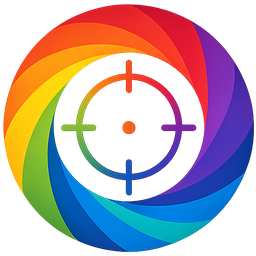
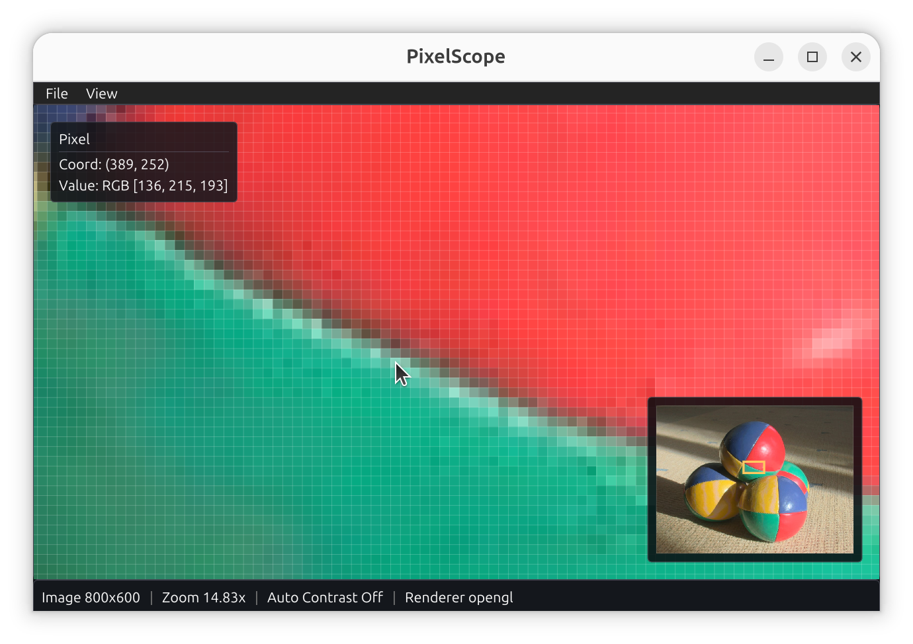

<h1> PixelScope</h1>

PixelScope is a cross-platform, lightweight desktop image inspection tool for exact pixel work. It is built for situations where you need to zoom deeply, pan quickly, inspect individual pixels, and verify what the image data is actually doing without interpolation or heavy viewer UI getting in the way.

The current app is a lightweight, efficient, minimalist SDL2 + Dear ImGui desktop viewer with a CPU-backed inspection path, nearest-neighbor rendering, and format loaders aimed at practical image debugging rather than image editing. The codebase is structured for macOS, Linux, and Windows builds through CMake and SDL renderer backends.

## Screenshot



## What It Does

PixelScope is designed around a simple idea: the value you inspect should come from the source image, not from a scaled presentation layer.

In practice, that means:

- Pixel readout comes from the full-resolution image in memory.
- Rendering uses nearest-neighbor scaling so individual source pixels stay crisp.
- Zoomed-out views can use cached downsampled display levels to stay responsive on large images.
- Zoomed-in views show a minimap so you can keep track of where you are in the full image.

## Current Features

- Open files from the menu, with `Ctrl+O`, by drag and drop, or from the command line.
- Run as a cross-platform desktop app on macOS, Linux, and Windows.
- Inspect `PNG`, `JPEG`, `TIFF`, `DNG`, and binary Bayer raw files.
- Zoom with the mouse wheel and pan by dragging with the left mouse button.
- Use `Fit to Window` and `1:1 Zoom` view resets.
- Inspect exact pixel coordinates and values while hovering.
- Display 16-bit pixel values when that data is available.
- Show raw Bayer sample values for Bayer-backed images.
- Toggle histogram, statistics, and metadata overlays from the `View` menu.
- Toggle a pixel grid at high zoom levels.
- Toggle auto contrast for display.
- Toggle RAW CFA color visualization for Bayer DNG or binary Bayer raw images.
- Show a lower-right minimap when the current field of view is smaller than the whole image.
- Show the active SDL renderer in the status bar so software-rendering fallbacks are obvious.

## Supported Formats

### Standard image formats

- `PNG`
- `JPG`
- `JPEG`

These are loaded through `stb_image` and normalized to RGBA8 for display and inspection.

### TIFF

- `TIF`
- `TIFF`

TIFF loading is handled separately and currently supports the common grayscale and RGB paths used by the app, including 8-bit and 16-bit channel data where available.

### DNG

- `DNG`

DNG files are decoded through the Rust `rawloader_bridge` helper. PixelScope keeps DNG metadata and supports raw Bayer inspection mode when the decoded frame is a Bayer plane.

### Binary Bayer raw

Known binary raw extensions include:

- `RAW`
- `BIN`
- `BAYER`

When a binary Bayer raw file is opened, PixelScope prompts for:

- Width
- Height
- Bit width
- CFA pattern
- Byte order

The app can prefill some of these fields by guessing from the filename, but the values are still user-confirmed at import time.

## Viewer Behavior

### Navigation

- Mouse wheel zooms in and out around the pointer.
- Left-button drag pans the image.
- `View -> Fit to Window` resets the image to the canvas.
- `View -> 1:1 Zoom` returns to native pixel scale.

### Pixel inspection

- Hovering reports the current pixel position.
- Standard images show RGB values.
- Images with high-precision pixel storage can show RGB16 values.
- Raw Bayer images show CFA channel label and raw sample value.

### Minimap

When the visible region is smaller than the full image, PixelScope shows a minimap in the lower-right corner of the canvas:

- The minimap is a thumbnail of the image.
- A highlighted rectangle marks the current field of view.
- The minimap hides itself automatically when the full image is already visible.

### Overlays

PixelScope currently provides these optional overlays from the `View` menu:

- `Histogram Overlay`
- `Image Statistics`
- `Metadata Overlay`
- `Pixel Grid`
- `Auto Contrast`
- `RAW CFA Colors`

Notes:

- Histogram and statistics are computed lazily and cached after first use.
- The pixel grid automatically enables once zoom is high enough unless it has been manually disabled.
- Metadata overlay includes the source path, dimensions, bit depth, channel count, format, and any extracted metadata entries.

## Performance Model

PixelScope keeps a full-resolution source image in memory for inspection, then selects a smaller precomputed display level when zoomed out. This keeps interaction responsive on larger files while preserving correct source-based inspection.

Important behavior:

- Pixel readout always comes from the source image model.
- Display textures are cached.
- Downsampled display levels are used only for drawing, not for inspection.
- Display scaling is nearest-neighbor only.

## Build Requirements

You need these tools installed before configuring the project:

- CMake 3.24 or newer
- A C++20 compiler
- Rust toolchain with `cargo` and `rustc`
- `libtiff` development files
- Git
- Network access during the first CMake configure so third-party dependencies can be fetched

The project currently fetches these dependencies during CMake configure:

- SDL2
- Dear ImGui
- `stb`
- `tinyfiledialogs`

The build also compiles two Rust helper executables:

- `rawloader_bridge` for DNG decoding
- `metadata_bridge` for metadata extraction

## Linux Setup

On Ubuntu or Debian, this is a practical starting point:

```bash
sudo apt update
sudo apt install -y \
  build-essential \
  cmake \
  git \
  pkg-config \
  libtiff-dev \
  curl
```

Install Rust if it is not already available:

```bash
curl https://sh.rustup.rs -sSf | sh
source "$HOME/.cargo/env"
```

For smooth hardware-accelerated rendering on Linux, install graphics userspace packages too:

```bash
sudo apt install -y \
  libgl1-mesa-dev \
  libegl1-mesa-dev \
  libgles2-mesa-dev \
  mesa-utils
```

If your machine uses NVIDIA, make sure the appropriate proprietary driver is installed and active. If PixelScope reports `Renderer software` in the status bar, SDL was not able to acquire an accelerated backend and interaction will usually feel slower.

## Build

Configure:

```bash
cmake -S . -B build
```

Build:

```bash
cmake --build build -j
```

The main executable is produced at:

```bash
./build/pixelscope
```

## Run

Start the viewer with no file:

```bash
./build/pixelscope
```

Open a file immediately:

```bash
./build/pixelscope /path/to/image.png
```

After launch you can also open files from:

- `File -> Open...`
- `Ctrl+O`
- drag and drop onto the window

## Menu Overview

### File

- `Open...`
- `Quit`

### View

- `Fit to Window`
- `1:1 Zoom`
- `Histogram Overlay`
- `Image Statistics`
- `Metadata Overlay`
- `Pixel Grid`
- `Auto Contrast`
- `RAW CFA Colors` for raw Bayer-backed images

## Typical Workflow

1. Open an image.
2. Zoom into the region you care about.
3. Pan until the area of interest is centered.
4. Use the minimap to stay oriented when only a small part of the image is visible.
5. Hover to inspect exact pixel coordinates and values.
6. Enable histogram, statistics, metadata, or auto contrast as needed for analysis.

## Tests

If tests are enabled, build and run them with:

```bash
cmake --build build --target pixelscope_tests
ctest --test-dir build --output-on-failure
```

Notes:

- Test building is controlled by the CMake option `PIXELSCOPE_BUILD_TESTS`, which defaults to `ON`.
- The current test target is `pixelscope_tests`.
- Some tests expect image fixtures to exist in the repository checkout. If those fixtures are missing, tests can fail even when the application itself builds correctly.

## Project Layout

High-level source layout:

- `src/core`: image data structures, viewport math, histogram/statistics, display-level generation
- `src/io`: format loaders, metadata extraction, file dialogs, binary raw import
- `src/render`: SDL texture caching
- `src/ui`: application UI and overlays
- `tools/rawloader_bridge`: Rust helper for DNG decoding
- `tools/metadata_bridge`: Rust helper for metadata extraction
- `tests`: project tests

## Limitations And Scope

PixelScope is currently an inspection tool, not a full image editor or RAW workflow application.

Current scope notes:

- DNG support focuses on decode, display, metadata, and raw-plane inspection.
- Binary Bayer raw import depends on user-supplied dimensions and Bayer interpretation settings.
- The app uses nearest-neighbor display only.
- The README documents the current implemented behavior, not planned future features.

## License

PixelScope is available under the MIT License. See [LICENSE](LICENSE).
